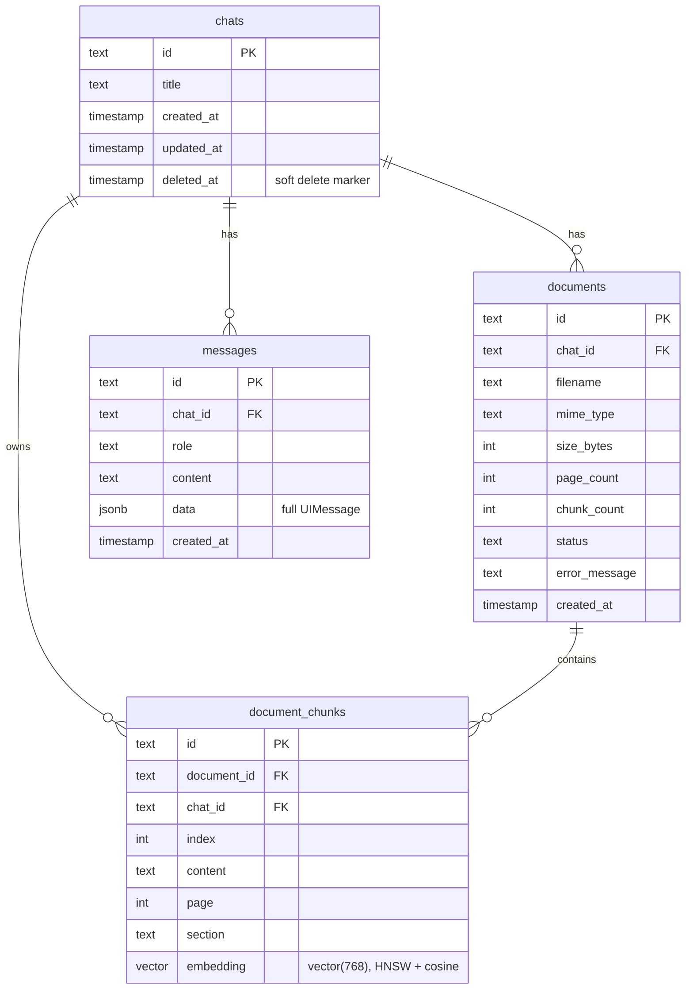

# Kleo Doc

A document Q&A app: upload a PDF, TXT, or Markdown file and ask questions about
it. Answers are streamed, retrieval-grounded, and backed by clickable citations
(`[A1]`, `[B2]`) that open the exact source excerpt.

Built with **Next.js 16** (App Router, TypeScript, Turbopack), the **Vercel AI
SDK 7**, **Neon Lakebase Postgres** with `pgvector`, and **Drizzle ORM**.

## Table of Contents

- [Setup](#setup)
  - [Prerequisites](#prerequisites)
  - [Install and run](#install-and-run)
  - [Environment variables](#environment-variables)
  - [Scripts](#scripts)
- [Architecture](#architecture)
  - [Data flow](#data-flow)
  - [Database schema](#database-schema)
  - [API](#api)
  - [Project structure](#project-structure)
- [Key trade-offs](#key-trade-offs)
- [Time spent](#time-spent)
- [AI tools used](#ai-tools-used)
- [Example: correcting AI-generated output](#example-correcting-ai-generated-output)

## Setup

### Prerequisites

- Node.js 20+ and npm
- A Neon project (or any Postgres with `pgvector`)
- API keys for the embedding model (Google Gemini) and the chat model (DeepSeek)

### Install and run

```bash
npm install
cp .env.example .env.local   # fill in the values below
npm run db:migrate
npm run dev
```

Open [http://localhost:3000](http://localhost:3000).

### Environment variables

| Variable                       | Purpose                                                                                                                                         |
| ------------------------------ | ----------------------------------------------------------------------------------------------------------------------------------------------- |
| `DATABASE_URL`                 | Pooled connection for app traffic                                                                                                               |
| `DATABASE_URL_UNPOOLED`        | Direct connection for migrations                                                                                                                |
| `NEON_BRANCH`                  | Linked Neon branch name                                                                                                                         |
| `GOOGLE_GENERATIVE_AI_API_KEY` | Embeddings (required)                                                                                                                           |
| `DEEPSEEK_API_KEY`             | DeepSeek chat model (default)                                                                                                                   |
| `OPENAI_API_KEY`               | OpenAI chat model (optional)                                                                                                                    |
| `CHAT_MODEL`                   | e.g. `deepseek:deepseek-chat`, `openai:gpt-4o-mini`, `google:gemini-2.0-flash`                                                                  |
| `APP_PASSWORD`                 | Optional. If set, the app shows an unlock screen and all chat/upload APIs require this password (anti-abuse for demos). Leave empty to disable. |

### Scripts

| Command               | Description                  |
| --------------------- | ---------------------------- |
| `npm run dev`         | Start the dev server         |
| `npm run build`       | Create a production build    |
| `npm run start`       | Run the production server    |
| `npm run lint`        | Run ESLint                   |
| `npm run db:generate` | Generate a Drizzle migration |
| `npm run db:migrate`  | Apply migrations             |
| `npm run db:studio`   | Open Drizzle Studio          |

## Architecture

### Data flow

1. **Upload** — `POST /api/documents` parses the file (PDF via `unpdf`, text
   and Markdown via a plain-text parser), splits it into overlapping chunks
   (keeping page/section), embeds each chunk with Gemini
   `gemini-embedding-2` (768-dim), and stores it in `document_chunks`.
2. **Ask** — `POST /api/chat` embeds the question and runs a cosine-similarity
   search over the chat's chunks. The top matches become numbered excerpts in
   the system prompt, along with a `presentEvidence` tool.
3. **Stream** — the model streams a grounded answer and calls
   `presentEvidence` with citation labels (e.g. `[A1]`, `[B2]`). The UI turns
   those into clickable links that open the source excerpt in a modal.
4. **Persist** — messages are written server-side when the stream ends, so
   conversations survive reloads. Chat rows are created lazily on the first
   message or upload, not when "New chat" is clicked.

### Database schema



Key points:

- Chunks are scoped to both their document and the chat, so a chat can hold
  several documents and searches never leak across chats.
- `embedding` is a `vector(768)` with an HNSW index using
  `vector_cosine_ops` for fast approximate cosine search.
- `messages.data` stores the complete Vercel AI SDK `UIMessage` (parts, tool
  calls, tool output), so the UI can re-render citations and evidence after a
  reload.
- **Soft delete.** Deleting a chat sets `deleted_at` instead of removing the
  row, so the conversation (messages, documents, chunks) stays in the database
  for auditability while staying hidden from the UI.

### API

| Route                            | Purpose                                                                            |
| -------------------------------- | ---------------------------------------------------------------------------------- |
| `GET` / `POST /api/chats`        | List chats / create a chat                                                         |
| `GET` / `DELETE /api/chats/[id]` | Load a chat (messages + documents) / soft-delete it (row retained, hidden from UI) |
| `POST /api/documents`            | Upload and ingest a document                                                       |
| `POST /api/chat`                 | Streaming RAG answer (tools, citations, persist)                                   |
| `GET /api/health`                | Health check                                                                       |

### Project structure

```
src/
  app/
    page.tsx                Chat app (chats + messages + upload)
    api/
      chat/route.ts         Streaming RAG chat
      chats/route.ts        List / create chats
      chats/[id]/route.ts   Load / delete a chat
      documents/route.ts    Upload + ingest
      health/route.ts       Health check
  components/chat/
    chat-app.tsx            Layout, sidebar state, URL sync
    chat-sidebar.tsx        Chat list (desktop + full-screen mobile)
    chat-stream.tsx         Chat UI, upload, streaming, scroll
    message-list.tsx        Message list + typing placeholder
    message-bubble.tsx      Bubble, citations, evidence modal
    composer.tsx            Composer (attach, input, send)
    states.tsx              Empty / loading / error states
    document-brief-card.tsx Upload overview card
    evidence-modal.tsx      Citation evidence modal
  db/
    schema.ts               Drizzle schema
    index.ts                Drizzle client
  lib/
    ai/                     Providers + embeddings
    db/queries.ts           All chat-scoped queries
    documents/              Parse, chunk, ingest
    prompts.ts              System prompt + tool instructions
    retrieval.ts            Vector search + citation labels
    tools.ts                presentEvidence + documentBrief tools
```

## Key trade-offs

- **Lazy chat creation.** Chat rows are only inserted on the first message or
  upload, so the database never fills with empty conversations. The cost is an
  extra `ensureChat()` round-trip before the first send.
- **Server-side persistence.** Messages are persisted as a full snapshot in
  `onEnd` (`replaceChatMessages`) rather than per-part. Simpler and atomic, but
  persistence depends on the stream completing.
- **`pgvector` HNSW + cosine** with 768-dim Gemini embeddings — a good
  recall/speed balance that stays well under pgvector's dimension limits.
- **Overlapping chunks (1200 chars, 200 overlap)** that keep page/section —
  balances context density against retrieval precision and preserves locators.
- **Extension-based MIME validation** rather than trusting the browser-reported
  MIME type, which varies per OS/browser (e.g. `.md` was being rejected).
- **Direct `scrollTop` instead of `scrollIntoView`.** Smooth `scrollIntoView`
  silently failed inside the nested `overflow-hidden` layout; the message list
  now scrolls directly with stick-to-bottom tracking.
- **Soft deletes over hard deletes.** Chat deletion stamps `deleted_at` rather
  than removing rows, so conversations are never lost — useful in a demo where
  you might want to recover from accidental deletes. The trade-off is that
  deleted rows accumulate forever unless a cleanup job prunes them.

## Time spent

About **4 hours** across a couple of sessions.
Full disclosure: I didn't hand-type every line. GitHub Copilot did a lot of the heavy lifting while I
directed, reviewed, and tested the result.

## AI tools used

- **GitHub Copilot (VS Code)** — pair-programming assistant for implementation,
  refactoring, and debugging throughout the build.
- **Vercel AI SDK** — streaming, tool calling, and the `useChat`/`streamText`
  loop.
- **Google Gemini `gemini-embedding-2`** — document and query embeddings.
- **DeepSeek `deepseek-chat`** — the default chat model for grounded answers.

## Example: correcting AI-generated output

The citation system initially asked the chat model to pass **raw chunk UUIDs**
to the evidence tool. But the system prompt only showed the model numbered
excerpts — never the IDs — so the model started **inventing plausible-looking
UUIDs**. The tool then returned empty evidence, and no cards rendered.

During testing this was caught, and the design was corrected: citations became
**server-resolved labels** (`A1`, `B2`) — the model passes the label it already
used in the text, and the server maps it to the real chunk. This both fixed the
hallucinated IDs and made citations unambiguous when a chat holds multiple
documents.
